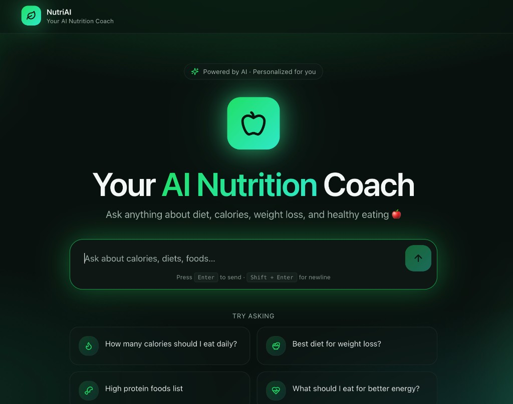
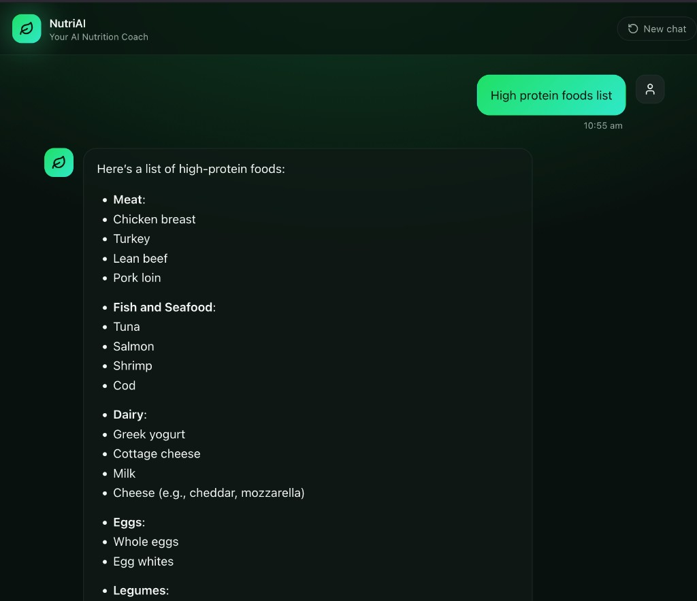

# AI-Powered Fitness 

An AI-powered nutrition chat application. Ask questions about calories, diets, weight loss, and healthy eating and get instant, evidence-based responses from an AI nutrition coach.

---

## Screenshots

| Home | Chat |
|------|------|
|  |  |

---

## Architecture

```
                        ┌─────────────────────────────────────────┐
                        │        nginx-ingress (single LB IP)     │
                        │                                         │
                        │  /chat  ──▶  backend-fitness-app-svc   │
                        │  /*     ──▶  frontend-fitness-app-svc  │
                        └─────────────────────────────────────────┘
                                  │                    │
                    ┌─────────────┘                    └──────────────┐
                    ▼                                                  ▼
     ┌──────────────────────┐                        ┌─────────────────────┐
     │   FastAPI Backend    │                        │   React Frontend    │
     │  (Uvicorn + OpenAI)  │                        │   (Vite + Nginx)    │
     └──────────────────────┘                        └─────────────────────┘
         (ClusterIP svc)                                 (ClusterIP svc)
```

Both services are deployed on **Google Kubernetes Engine (GKE)** in the `fitness-ns` namespace behind a single **nginx-ingress controller**, with images stored in **Google Artifact Registry**.

---

## Project Structure

```
ai-powered-fitness/
├── frontend/                     # React + Vite chat UI
│   ├── src/
│   │   ├── components/
│   │   │   ├── chat/             # AiAvatar, ChatMessage, InputBox, SampleQuestions, TypingIndicator
│   │   │   ├── ui/               # Reusable shadcn/ui components
│   │   │   └── NavLink.tsx
│   │   ├── hooks/
│   │   │   ├── useNutritionChat.ts
│   │   │   ├── use-mobile.tsx
│   │   │   └── use-toast.ts
│   │   ├── lib/
│   │   │   └── utils.ts
│   │   ├── pages/
│   │   │   ├── Index.tsx
│   │   │   └── NotFound.tsx
│   │   ├── services/
│   │   │   └── nutritionApi.ts   # Fetch client for /chat endpoint
│   │   └── test/
│   │       ├── example.test.ts
│   │       └── setup.ts
│   ├── public/
│   ├── .env.production           # VITE_API_BASE_URL (empty = same-origin)
│   ├── Dockerfile                # Multi-stage: Node build → Nginx serve
│   ├── deployment.yaml           # GKE Deployment + ClusterIP Service
│   ├── vite.config.ts
│   ├── vitest.config.ts
│   └── tailwind.config.ts
│
├── backend/                      # FastAPI nutrition AI service
│   ├── app/
│   │   ├── api/
│   │   │   └── routes.py         # POST /chat route
│   │   ├── core/
│   │   │   └── config.py         # Settings from environment variables
│   │   ├── schemas/
│   │   │   └── chat.py           # ChatRequest / ChatResponse models
│   │   ├── services/
│   │   │   └── openai_service.py # OpenAI chat completions
│   │   └── main.py               # App entrypoint, CORS middleware
│   ├── .env.example
│   ├── requirements.txt
│   ├── Dockerfile
│   └── deployment.yaml           # GKE Deployment + ClusterIP Service
│
├── ingress.yaml                  # nginx-ingress: routes /chat → backend, /* → frontend
└── README.md
```

---

## Tech Stack

| Layer | Technology |
|---|---|
| Frontend | React 18, TypeScript, Vite 5 |
| Styling | Tailwind CSS, Radix UI, shadcn/ui |
| State / Data | TanStack React Query, react-hook-form, Zod |
| Backend | FastAPI, Uvicorn, Python 3.11 |
| AI | OpenAI API (`gpt-4o-mini` by default) |
| Containerization | Docker (multi-stage builds) |
| Orchestration | Kubernetes (GKE) |
| Ingress | nginx-ingress controller (Helm) |
| Registry | Google Artifact Registry |

---

## Local Development

### Prerequisites

- Node.js 20+
- Python 3.11+
- Docker
- An OpenAI API key

### Backend

```bash
cd backend
pip install -r requirements.txt
OPENAI_API_KEY=your-key-here uvicorn app.main:app --reload --port 8000
```

### Frontend

```bash
cd frontend
npm install
echo "VITE_API_BASE_URL=http://localhost:8000" > .env.local
npm run dev
```

Open [http://localhost:8080](http://localhost:8080).

---

## Environment Variables

### Backend

| Variable | Required | Default | Description |
|---|---|---|---|
| `OPENAI_API_KEY` | Yes | — | OpenAI API key |
| `MODEL_NAME` | No | `gpt-4o-mini` | OpenAI model to use |

### Frontend

| Variable | Required | Default | Description |
|---|---|---|---|
| `VITE_API_BASE_URL` | No | `""` (same-origin) | Base URL of the FastAPI backend |

> Vite bakes `VITE_*` variables into the bundle at **build time**. Set them in `.env.production` before building the Docker image.

---

## Docker

Both images must be built for `linux/amd64` when building on Apple Silicon:

```bash
# Backend
docker buildx build \
  --platform linux/amd64 \
  -t us-east1-docker.pkg.dev/<project>/nutrition-repo/backend_fitness_app:latest \
  --push ./backend

# Frontend
docker buildx build \
  --platform linux/amd64 \
  -t us-east1-docker.pkg.dev/<project>/nutrition-repo/frontend_fitness_app:latest \
  --push ./frontend
```

---

## Kubernetes Deployment (GKE)

### 1. Install nginx-ingress controller

```bash
helm repo add ingress-nginx https://kubernetes.github.io/ingress-nginx
helm repo update
helm install ingress-nginx ingress-nginx/ingress-nginx \
  --namespace ingress-nginx \
  --create-namespace
```

Wait for the controller's external IP to be assigned (~1–2 minutes):

```bash
kubectl get svc ingress-nginx-controller -n ingress-nginx --watch
```

Copy the `EXTERNAL-IP` once it appears — this is your single public entry point for the whole app. Press `Ctrl+C` once you have it.

### 2. Deploy the application

```bash
# Create the namespace
kubectl create namespace fitness-ns

# Deploy backend and frontend
kubectl apply -f backend/deployment.yaml
kubectl apply -f frontend/deployment.yaml

# Apply the ingress routing rules
kubectl apply -f ingress.yaml
```

### 3. Verify everything is up

```bash
# All pods should be Running
kubectl get pods -n fitness-ns

# Services should show ClusterIP (no external IP — expected)
kubectl get svc -n fitness-ns

# Ingress should reflect the nginx-ingress EXTERNAL-IP
kubectl get ingress -n fitness-ns
```

### 4. Test it

```bash
# Frontend
curl http://<EXTERNAL-IP>/

# Backend
curl http://<EXTERNAL-IP>/chat -X POST \
  -H "Content-Type: application/json" \
  -d '{"message": "How many calories should I eat daily?"}'
```

### 5. Update after a new image push

```bash
kubectl rollout restart deployment/backend-fitness-app -n fitness-ns
kubectl rollout restart deployment/frontend-fitness-app -n fitness-ns
```

> **Adding SSL later:** Once you have a domain, point it to the nginx-ingress `EXTERNAL-IP`, install cert-manager, and add a `tls` block to `ingress.yaml`. Update `allow_origins` in `backend/app/main.py` to your domain at that point.

---

## API Reference

### `POST /chat`

**Request**
```json
{ "message": "How many calories should I eat daily?" }
```

**Response**
```json
{ "reply": "Daily calorie needs depend on age, weight, height, and activity level..." }
```

### `GET /`

Health check — returns `{ "status": "ok" }`.
